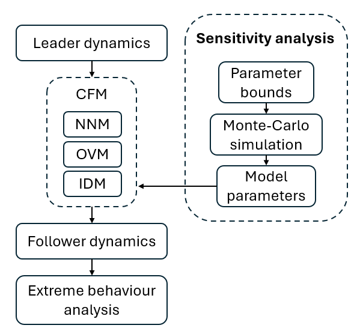

# CFM-extreme-behaviour
Nonlinear car following model performance evaluation and comparison 

The codes and results of the paper - A comparative study of Non-linear Car Following Models in real-driving scenarios are provided in this repository

The design of the experiment is presented in the following Figure. 

In this study Extreme behaviour analysis and Sensitivity analysis are conducted to evalute the performance of a Car Following Model (CFM).

The repository is structured as follows:

Codes:     Codes for calculating and plotting the results
Results:   Results for each model and condition